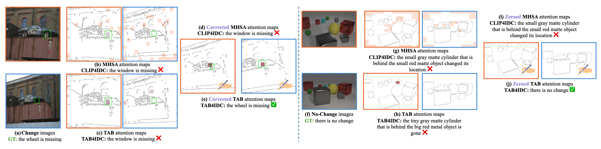

# TAB: Transformer Attention Bottlenecks enable User Intervention and Debugging in Vision-Language Models

<div align="center">    
    <p style="font-size: 45px;"> by 
        <a href="https://pooyanrg.me">Pooyan Rahmanzadehgervi</a><sup>1</sup>, 
        <a>Hung Huy Nguyen</a><sup>1</sup>, 
        <a href="https://rosanneliu.com/">Rosanne Liu</a><sup>2,3</sup>, 
        <a href="https://mai-t-long.com/">Long Mai</a><sup>4</sup>, 
        <a href="https://anhnguyen.me/research/">Anh Totti Nguyen</a><sup>1</sup>
    </p>
    <p>
        <sup>1</sup>Auburn University, 
        <sup>2</sup>Google DeepMind,
        <sup>3</sup>ML Collective,
        <sup>4</sup>Adobe Research
    </p>

[](https://arxiv.org/abs/2412.18675)
[](LICENSE)
[](https://huggingface.co/spaces/XAI/TAB4IDC-InterventionDemo)
    
</div>


## 📌 Abstract

<p align="center">
  <!-- Insert key figure from your paper here -->
  
</p>

*Multi-head self-attention (MHSA) is a key component of Transformers, a widely popular architecture in both language and vision.
Multiple heads intuitively enable different parallel processes over the same input. 
Yet, they also obscure the attribution of each input patch to the output of a model.
We propose a novel 1-head Transformer Attention Bottleneck (TAB) layer, inserted after the traditional MHSA architecture, to serve as an attention bottleneck for interpretability and intervention.
Unlike standard self-attention, TAB constrains the total attention over all patches to $\in [0, 1]$.
That is, when the total attention is 0, no visual information is propagated further into the network, and the vision-language model (VLM) would default to a generic, image-independent response.
To demonstrate the advantages of TAB, we train VLMs with TAB to perform image-difference captioning.
Over three datasets, our models perform similarly to baseline VLMs in captioning but the bottleneck is superior in localizing changes and in identifying when no changes occur.
TAB is the first architecture to enable users to debug by editing attention, which often produces expected outputs by VLMs.*


## Requirements

```sh
conda env create -f environment.yml
conda activate tab
```


## Data Preparing

**For CLEVR-Change**

The official data can be found here: [google drive link](https://drive.google.com/file/d/1HJ3gWjaUJykEckyb2M0MB4HnrJSihjVe/view) provided by [Robust Change Captioning (ICCV19)](https://github.com/Seth-Park/RobustChangeCaptioning). 

Extracting this file will create data directory.

```sh
tar -xzvf clevr_change.tar.gz
```

For the convenience, you can also download the three json files from [link](https://drive.google.com/drive/folders/1g8QD6Y3La8cIamE7jeSSlXTw8G3r5Q8o?usp=sharing).

You would get

```
your_data_path
|–– clevr_change/
|   |–– data/
|   |   |–– images/
|   |   |–– nsc_images/
|   |   |–– sc_images/
|   |   |–– sc_images/
|   |   |–– change_captions.json
|   |   |–– no_change_captions.json
|   |   |–– splits.json
|   |   |–– type_mapping.json
```

**For STD**

The image pairs and captions can be downloaded using the instructions [here](https://github.com/harsh19/spot-the-diff/blob/master/data/get_images.txt) privided by [Learning to Describe Differences Between Pairs of Similar Images (EMNLP 2018)](https://github.com/harsh19/spot-the-diff).

You would get

```
your_data_path
|–– std/
|   |–– resized_images/
|   |–– annotations/
```


**For OpenImages-I**

The test set is available [here](https://huggingface.co/datasets/XAI/OpenImages-Inpainted) provided by [Improving zero-shot object-level change detection by incorporating visual correspondence (WACV 2025)](https://arxiv.org/pdf/2501.05555)


Download CLIP (ViT-B/32 and ViT-B/16) weight,
```sh
wget -P ./modules https://openaipublic.azureedge.net/clip/models/40d365715913c9da98579312b702a82c18be219cc2a73407c4526f58eba950af/ViT-B-32.pt
wget -P ./modules https://openaipublic.azureedge.net/clip/models/5806e77cd80f8b59890b7e101eabd078d9fb84e6937f9e85e4ecb61988df416f/ViT-B-16.pt
```


## Training

We provide the bash scripts needed to run the 2-stage training in the [scripts folder](https://github.com/anguyen8/TAB/tree/main/scripts).


## Acknowledgment

This repository borrows a significant part of its implementation from [CLIP4IDC](https://github.com/sushizixin/CLIP4IDC) by Guo et al. We greatly appreciate their work, which provided a strong foundation for this project.
